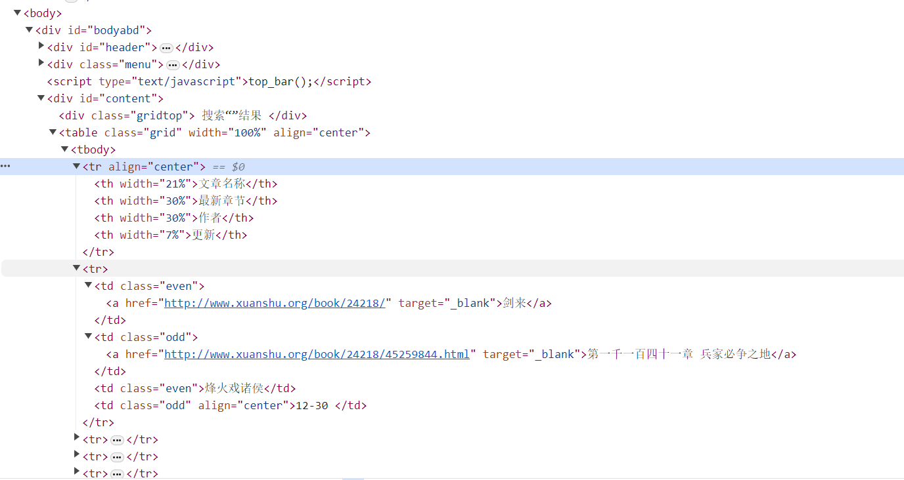

#  rabbit-foot

rabbit-foot 是一个使用 Json 来描述爬虫的动作，从而实现动态的爬虫。相较于通过硬编码来实现爬虫，这种方式更加灵活，只需要修改描述爬虫动作的Json就可以应对目标服务的改变，而无需从新编码

目前只支持使用 jsoup 对 HTML 页面的爬取
```xml
<dependency>
    <groupId>org.jsoup</groupId>
    <artifactId>jsoup</artifactId>
    <version>1.16.1</version>
</dependency>
```

## 爬虫控制
### 示例



上图展示了一个 HTML 解析的节点示例。最终的内容位于 `table.grid > tr > td` ,其爬虫描述如下：
```json
{
  "books": [
    {
      "name": "新笔趣阁",
      "spider-type": "search",
      "type": "com.rabbit.foot.core.spider.WebSpiderResolver",
      "site": {
        "method": "GET",
        "url": "http://localhost/abc/",
        "headers": {
          "Cookie": "此处填写京东登录Cookie"
        },
        "params": {
          "searchkey": "{params[0]}"
        }
      },
      "resolver-action": {
        "element": {
          "element-type": "class",
          "element-value": "grid",
          "content-type": "array",
          "element": {
            "element-type": "tage",
            "element-value": "tr",
            "content-type": "array",
            "element": {
              "element-type": "result",
              "element-value": "item",
              "content-type": "array",
              "start-assembly": true,
              "result-element": [
                {
                  "element-type": "class",
                  "element-value": "even",
                  "content-type": "obj",
                  "leaf-index": 0,
                  "is-leaf": true,
                  "target-key": "text",
                  "result-key": "title",
                  "interceptors": {
                    "type": "com.rabbit.foot.interceptors.MyHandlerInterceptors",
                    "prefix": "",
                    "suffix": ""
                  }
                },
                {
                  "element-type": "class",
                  "element-value": "even",
                  "content-type": "obj",
                  "element": {
                    "element-type": "tage",
                    "element-value": "a",
                    "content-type": "obj",
                    "leaf-index": 0,
                    "is-leaf": true,
                    "target-key": "href",
                    "result-key": "url",
                    "result-end": true,
                    "interceptors": {
                      "type": "com.rabbit.foot.interceptors.MyHandlerInterceptors",
                      "prefix": "",
                      "suffix": ""
                    }
                  }
                },
                {
                  "element-type": "class",
                  "element-value": "even",
                  "content-type": "obj",
                  "leaf-index": 1,
                  "is-leaf": true,
                  "target-key": "text",
                  "result-key": "author",
                  "interceptors": {
                    "type": "com.rabbit.foot.interceptors.MyHandlerInterceptors",
                    "prefix": "",
                    "suffix": ""
                  }
                },
                {
                  "element-type": "class",
                  "element-value": "odd",
                  "content-type": "obj",
                  "leaf-index": 0,
                  "is-leaf": true,
                  "target-key": "text",
                  "result-key": "newChapter",
                  "interceptors": {
                    "type": "com.rabbit.foot.interceptors.MyHandlerInterceptors",
                    "prefix": "",
                    "suffix": ""
                  }
                }
              ],
              "remove": [
                {
                  "element-type": "class",
                  "element-value": "grid"
                }
              ]
            }
          }
        }
      },
      "config": {
        "java-type": "com.rabbit.foot.entity.BookData"
      }
    }
  ]
}
```

### 示例说明

```json
{
  "books": [
    {
      "name": "爬虫分组名称，统一分组下可用同一个名字",
      "spider-type": "爬虫类型，同一个分组下不可以重复",
      "type": "指定解析的爬虫",
      "site": {
        "method": "请求方式",			
        "url": "请求路径",
        "headers": {
          "Cookie": "身份校验 Cookie"
        },
        "params": {
          "searchkey": "动态参数回填位置"
        }
      },
      "resolver-action": {
        "element": {
          "element-type": "根据class属性值查找节点",
          "element-value": "class属性的值",
          "content-type": "返回结果类型，array 为多个",
          "element": {
            "element-type": "根据tage标签查询节点",
            "element-value": "tr 类型的节点",
            "content-type": "返回结果类型",
            "element": {
              "element-type": "result 表示为伪节点，表示上一级节点是多个结果节点的父级节点，提示代码，开始遍历组装结果了",
              "element-value": "item 为固定值",
              "content-type": "array 解析的结果为 多个节点，通知代码进行遍历",
              "start-assembly": "是否要开始组装",
              "result-element": [
                {
                  "element-type": "根据class属性值查找节点",
                  "element-value": "class属性的值",
                  "content-type": "返回结果类型，obj 为单个",
                  "element": {
                    "element-type": "根据tage标签查询节点",
                    "element-value": "a 类型的节点",
                    "content-type": "返回结果类型，obj 为单个",
                    "leaf-index": "若有多个相同节点，获取从 0 开始指定下标的单个节点",
                    "is-leaf": "是否组装结果",
                    "target-key": "如果获取节点的属性值，就填写对应的属性值名称，比如  src，href，若获取标签内容则填写 txt",
                    "result-key": "对应的实体类属性值",
                    "result-end": "是否末级节点",
                    "interceptors": {
                      "type": "结果文本在组装前，进行数据处理的类",
                      "prefix": "数据处理前缀",
                      "suffix": "数据处理后缀"
                    }
                  }
                },
                {
                  "element-type": "class",
                  "element-value": "even",
                  "content-type": "obj",
                  "leaf-index": 1,
                  "is-leaf": true,
                  "target-key": "text",
                  "result-key": "author",
                  "interceptors": {
                    "type": "com.rabbit.foot.interceptors.MyHandlerInterceptors",
                    "prefix": "",
                    "suffix": ""
                  }
                }
              ],
              "remove": [
                {
                  "element-type": "class",
                  "element-value": "grid"
                }
              ]
            }
          }
        }
      },
      "config": {
        "java-type": "爬虫结果返回的实体类路径"
      }
    }
  ]
}
```

